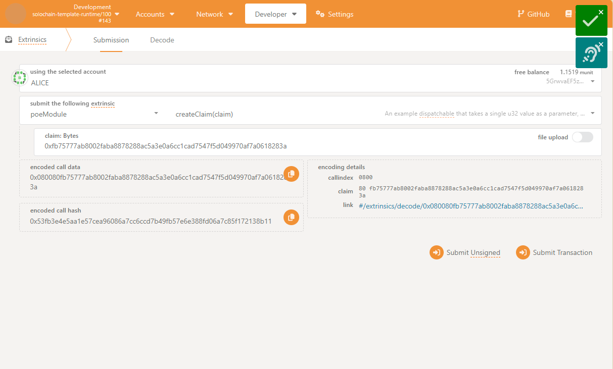
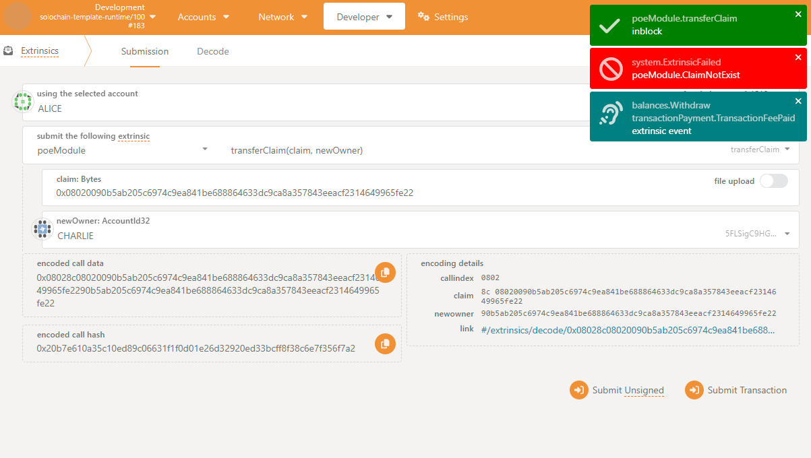
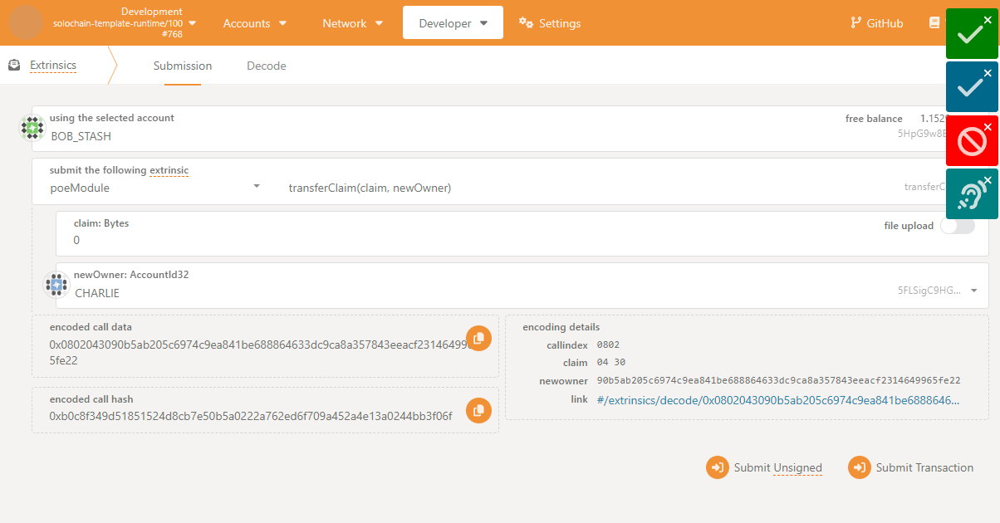

- **Proof of Existence (PoE) Pallet** 的核心目标是实现一个去中心化的存储系统，允许用户存储文件的哈希值，并证明某个文件在特定时间已经存在。并且可以撤销文件的哈希值，从而实现删除文件效果

### 使用 Polkadot-JS Apps 与 PoE Pallet 交互验证步骤：

- 调用 create_proof 存储文件的哈希值。

- 调用 revoke_proof 撤销文件的哈希值。

- 查询存储的哈希值。

- 编写poe模块代码
- 编译build
```
cargo build --release
```
- 运行node
```
./target/release/solochain-template-node --dev --temp
``` 

- 提交poe的交易

- 执行poe中的transferClaim

- 执行poe中的transferClaim(claim,newOwner)

- 查看账户变化


### 核心实现代码
```rust
#![cfg_attr(not(feature = "std"), no_std)]

use frame_support::{
    dispatch::DispatchResult,
    pallet_prelude::*,
    sp_runtime::traits::Hash,
};
use frame_system::pallet_prelude::*;

#[frame_support::pallet]
pub mod pallet {
    use super::*;

    // Pallet 配置
    #[pallet::config]
    pub trait Config: frame_system::Config {
        type RuntimeEvent: From<Event<Self>> + IsType<<Self as frame_system::Config>::RuntimeEvent>;
    }

    // Pallet 存储项
    #[pallet::storage]
    pub type Proofs<T: Config> = StorageMap<
        _,
        Blake2_128Concat,
        T::Hash,
        (T::AccountId, BlockNumberFor<T>),
    >;

    // Pallet 事件
    #[pallet::event]
    #[pallet::generate_deposit(pub(super) fn deposit_event)]
    pub enum Event<T: Config> {
        ProofStored { proof: T::Hash, owner: T::AccountId },
        ProofRevoked { proof: T::Hash },
    }

    // Pallet 错误
    #[pallet::error]
    pub enum Error<T> {
        ProofAlreadyExists,
        ProofNotFound,
        NotProofOwner,
    }

    // Pallet 实现
    #[pallet::pallet]
    pub struct Pallet<T>(_);

    #[pallet::call]
    impl<T: Config> Pallet<T> {
        // 存储文件的哈希值
        #[pallet::weight(10_000)]
        pub fn create_proof(origin: OriginFor<T>, proof: T::Hash) -> DispatchResult {
            let sender = ensure_signed(origin)?;

            // 检查哈希值是否已存在
            ensure!(!Proofs::<T>::contains_key(&proof), Error::<T>::ProofAlreadyExists);

            // 存储哈希值和所有者
            Proofs::<T>::insert(
                &proof,
                (sender.clone(), frame_system::Pallet::<T>::block_number()),
            );

            // 触发事件
            Self::deposit_event(Event::ProofStored {
                proof,
                owner: sender,
            });

            Ok(())
        }

        // 撤销文件的哈希值
        #[pallet::weight(10_000)]
        pub fn revoke_proof(origin: OriginFor<T>, proof: T::Hash) -> DispatchResult {
            let sender = ensure_signed(origin)?;

            // 检查哈希值是否存在
            let (owner, _) = Proofs::<T>::get(&proof).ok_or(Error::<T>::ProofNotFound)?;

            // 检查调用者是否为所有者
            ensure!(sender == owner, Error::<T>::NotProofOwner);

            // 删除哈希值
            Proofs::<T>::remove(&proof);

            // 触发事件
            Self::deposit_event(Event::ProofRevoked { proof });

            Ok(())
        }
    }
}
```
